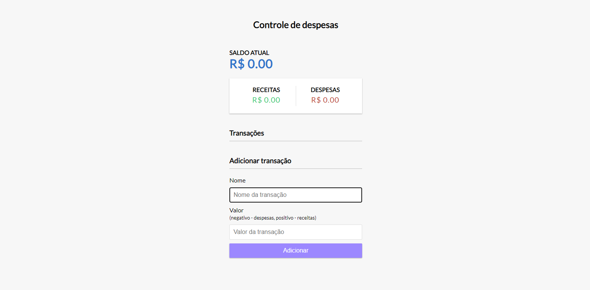
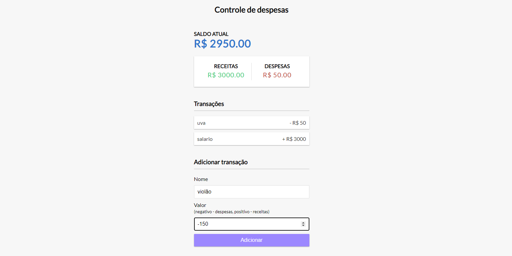
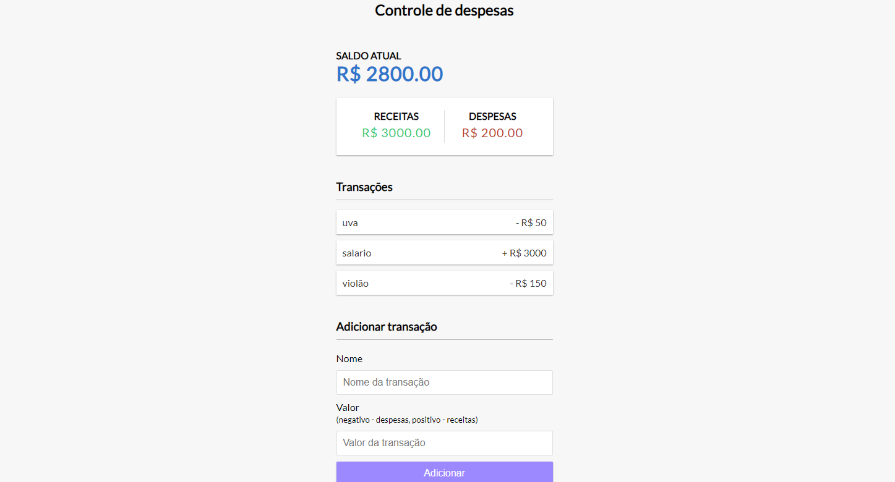

# __Controlador De Despesas__

## aplicação em __Javascrpript__ __HTML__ e __CSS__ que faz o controle financeiro e armazena todas as informações no local storage podendo dar refresh na pagina que não se altera

